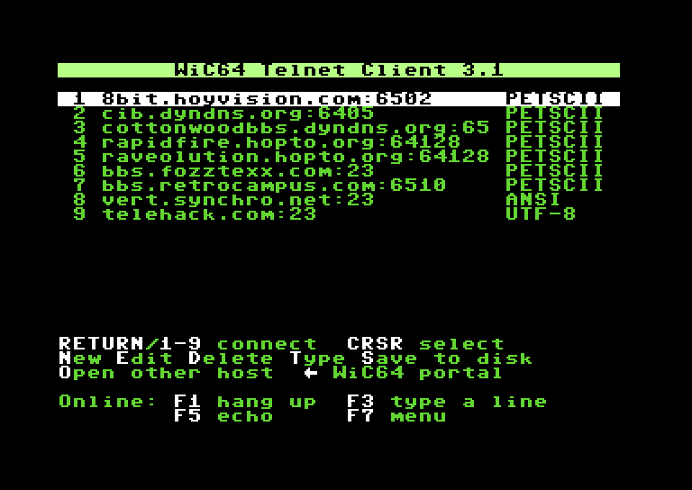
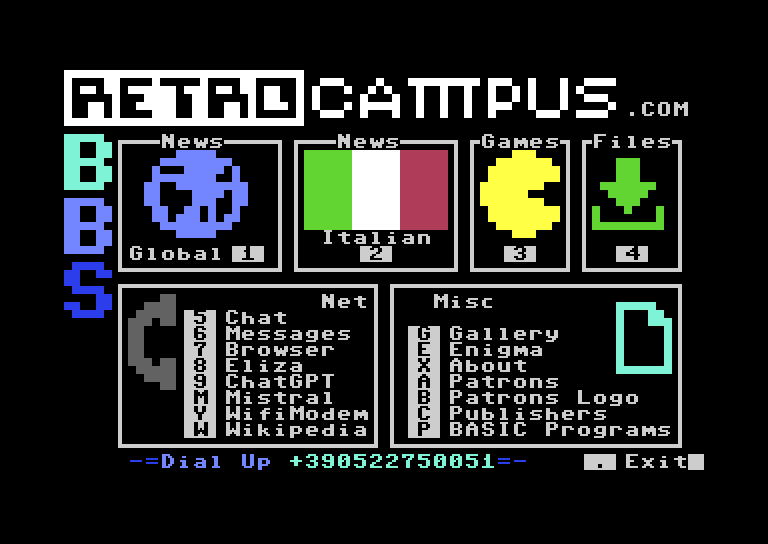
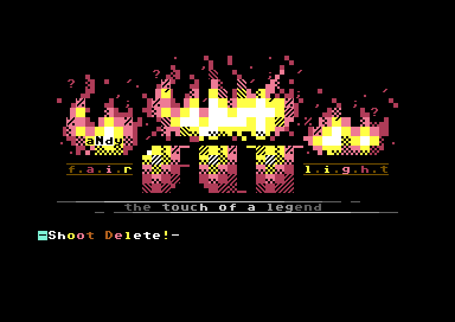
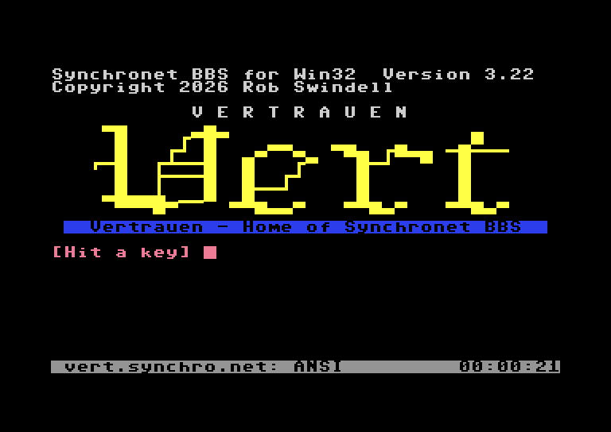
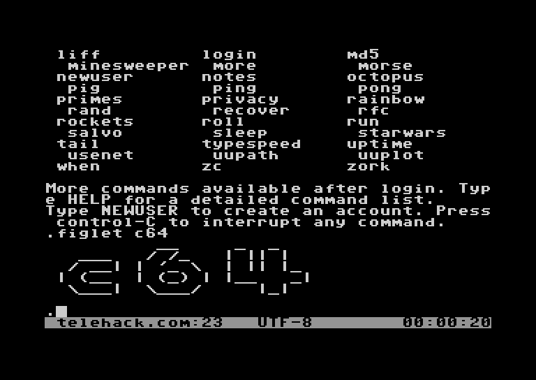

# WiC64 Telnet Client 3.2

A Telnet client for the Commodore 64 with a WiC64 (firmware 2.0.0 or later).

**Download:** [`telnet.prg`](https://github.com/huysmki/wic64-telnet/releases/latest/download/telnet.prg)
from the [latest release](https://github.com/huysmki/wic64-telnet/releases/latest)
— copy it to a disk (or SD card) and `LOAD"TELNET.PRG",8` / `RUN`.

To build it yourself with [ACME](https://sourceforge.net/projects/acme-crossass/):
`make` gives `build/telnet.prg`.

| PETSCII | PETSCII |
|---------|---------|
|  |  |
| **ANSI** | **UTF-8 80** |
|  |  |

*RetroCampus, Rapidfire, Vertrauen and Telehack, taken in VICE with its WiC64
emulation.*

## Terminal modes

| Mode    | For                 | Screen                                                                               |
|---------|---------------------|--------------------------------------------------------------------------------------|
| PETSCII | Commodore BBSes     | 40×25, colors and graphics as the BBS sends them                                     |
| ANSI    | PC BBSes            | 40×24 + status line; ANSI/VT100 escape codes, CP437 line drawing and blocks          |
| UTF-8   | Unix hosts, MUDs    | like ANSI, with UTF-8 characters (box drawing, accents → nearest ASCII)              |
| ANSI 80, UTF-8 80 | the same, for hosts that expect 80 columns | 80×24 + status line, characters 4 pixels wide |

Each server in the address book has its own mode (`T` on the start screen).
During a session, `F7` then `M` switches mode. A PETSCII session switches to
ANSI by itself when the server draws with ANSI escape codes (colours, cursor
positioning, clearing). ANSI detection queries such as `ESC [ 5 n`, which
some Commodore BBSes send at login, are ignored and left unanswered, so those
BBSes stay in PETSCII. For a UTF-8 host, press `F7`, `M` once more.

In every mode, the bell character (sent for chat requests, for example)
flashes the border white and plays a short ping on the SID.

## 80 columns

ANSI 80 and UTF-8 80 put 80 columns on the screen, with characters made 4
pixels wide from the C64's own font when the mode starts (the few letters
that do not suit are drawn by hand). Most Unix hosts and some BBSes expect
80 columns, and their lines then fit instead of wrapping. The status line,
the session menu and line input look as in the other modes.

The screen is a hires bitmap, which has one colour per block of 8×8 pixels:
two characters next to each other share their colour (the left one's,
unless that is a blank). Text looks fine; colourful ANSI art looks better
in 40 columns. Drawing on a bitmap is also more work for the C64, so a
screen full of fast output scrolls more slowly than in 40 columns.

The C64 has one background colour, so a coloured ANSI background shows as
reverse video in that colour. Blink shows as a bright background (iCE
colours), which is what most PC BBS art means by it. 256-colour and true
colour codes show as the nearest of the 16 ANSI colours. Full-screen Unix
programs get an alternate screen (the screen comes back when vim or less
exits) and application cursor keys when they ask for them.

## Keys

Start screen: `CRSR` select, `HOME` first entry, `RETURN` or `1`–`9` connect,
`N` new, `E` edit, `D` delete, `T` mode, `S` save to disk, `O` connect to a
host that isn't in the list (starts in PETSCII mode), `←` WiC64 portal. When
editing, the C64 screen editor overwrites text; use `INST` to insert.

Online: `F1` hang up, `F3` type a whole line (up to 80 characters),
`F5` local echo on/off, `F7` session menu (mode, echo, scrollback, file
download, Telnet break / interrupt / are-you-there, hang up), `SHIFT F7`
scrollback.
`RUN/STOP`+`RESTORE` leaves the program for BASIC in any mode, without
hanging up; `RUN` starts it again.

## File downloads

Many BBSes have file areas. Start the download on the BBS first, then press
`F7`, `D` and pick the protocol:

- `X` **XMODEM**, what PC BBSes (and most others) offer. The client asks for
  CRC and takes 128-byte as well as 1 KB blocks (XMODEM-1K), or falls back to
  a checksum. It asks for the file type (PRG, SEQ or USR). XMODEM pads the
  last block with `$1A` bytes, which stay at the end of the file, as with
  CCGMS: the protocol doesn't say where a file ends.
- `P` **Punter** (C1), the protocol of Commodore BBSes. The sender gives the
  file type, and the file arrives at its exact length.

A Commodore BBS that is ready to send with Punter repeats `GOO` until the
terminal answers. After three `GOO`s in a row the client starts the download
by itself, at once, as some BBSes give up when the answer takes too long.
Once it has stopped, the next `GOO`s don't start it again until the BBS has
sent something else.

The file is saved as `download.tmp` on the drive the program was loaded from
(device 8 if unknown), while a box shows how many bytes have come in; neither
protocol sends the file's name. Once it is complete, the client asks for the
name and renames the file, asking again if the drive refuses (such as
`63, FILE EXISTS`). `RUN/STOP` stops the download (an XMODEM sender is told
to stop too); what came so far stays as `download.tmp`, which the next
download replaces. If the drive reports another error, the box shows it. In VICE, with a 1541, an XMODEM-1K
download ran at about 230 bytes a second.

The client doesn't take Telnet commands out of the data unless the server
spoke Telnet: many Commodore BBSes don't, and their files contain `$FF`.

## Scrollback

Rows that scroll off the top of the screen are kept, and so is the whole
screen when the server clears it (Commodore BBSes clear it for almost every
menu). `SHIFT F7`, or `F7` then `S`, shows them above the current screen,
starting a page back: `CRSR` up/down one row, `F1`/`F3` a page up/down,
`HOME` the oldest row, `CLR` the current screen; any other key goes back to
the session. Nothing is read from the server meanwhile, so nothing is missed.

There is room for 16 KB of rows. A row is kept without its trailing blanks,
so that is about 260 full rows, and typically 350 or more; in 80 columns,
which need some of that memory, 7 KB, about 55 full rows. When it is full
the oldest rows make way. The scrollback starts empty when the terminal mode
changes (its rows only look right in their own character set) and at each
connection. In the ANSI modes rows that scroll within a part of the screen
(a full-screen program's scroll region) and the alternate screen are not
kept, and `ESC [ 3 J` empties the scrollback, as in xterm.

In the ANSI modes the bottom row is a status line: host, mode, `echo` when
local echo is on, and the time online.

In ANSI and UTF-8 modes the keyboard sends ASCII:

| C64 key            | Sends            |
|--------------------|------------------|
| cursor keys, `HOME`, `CLR` | `ESC [ A`–`D`, `ESC [ H`, `ESC [ F` (`ESC O …` when the host asks for application cursor keys) |
| `←`                | ESC              |
| `CTRL`+letter      | control code (e.g. CTRL+C, also CTRL+Q/S) |
| `DEL`              | DEL (`$7F`)      |
| `£` / `SHIFT £`    | `\` / `\|`       |
| `↑` / `SHIFT ↑`    | `^` / `~`        |
| `SHIFT -`, `SHIFT @`, `SHIFT *`, `SHIFT +` | `_`, `` ` ``, `{`, `}` |

## Telnet

The client only answers negotiation; it never starts one. Servers without
Telnet support therefore receive nothing except your keystrokes. It agrees to
BINARY, ECHO, SGA, TTYPE (reports `PETSCII` or `ANSI`) and NAWS (40×25,
40×24 or 80×24), and refuses every other option. When the server takes over echoing,
local echo is switched off, and back on when the server stops echoing
(as some do after a password).

`RETURN` sends a bare CR in PETSCII mode (what Commodore BBSes expect) and the
Telnet end of line CR NUL in the ANSI modes (a bare CR in binary mode).

## Connection problems

A request the WiC64 doesn't answer in time is retried quietly up to three
times. After that, or on any other error, a box shows the WiC64's message
with `F1` Abort and `F3` Retry; Retry reconnects if the WiFi or network
connection was lost.

## Address book

It comes with nine servers that were online when this version was made:

| # | Server | Mode |
|---|--------|------|
| 1 | `8bit.hoyvision.com:6502` (8-Bit Playground) | PETSCII |
| 2 | `particlesbbs.dyndns.org:6400` (Particles! BBS) | PETSCII |
| 3 | `cottonwoodbbs.dyndns.org:6502` | PETSCII |
| 4 | `rapidfire.hopto.org:64128` | PETSCII |
| 5 | `raveolution.hopto.org:64128` | PETSCII |
| 6 | `bbs.fozztexx.com:23` (Level 29) | PETSCII |
| 7 | `bbs.retrocampus.com:6510` | PETSCII |
| 8 | `vert.synchro.net:23` (Vertrauen, home of Synchronet) | ANSI |
| 9 | `telehack.com:23` | UTF-8 80 |

Telehack writes 80-column text whatever window size it is told, so it is set
to UTF-8 80; in UTF-8 its longer lines wrap onto two rows.

The list is stored in `telnet.cfg` on the drive the program was loaded from
(device 8 if unknown). It is loaded at start-up and written when you press `S`:
first as `telnet.tmp`, which then replaces `telnet.cfg`, so a failed save
leaves the old list on the disk.

## Credits and licence

Based on the [WiC64 Simple Telnet Client](https://github.com/WiC64-Team/wic64-telnet)
by Henning Liebenau, and built on his
[WiC64 library](https://github.com/WiC64-Team/wic64-library) (`wic64.asm`,
`wic64.h`, included unchanged). The Punter download follows
[CCGMS Term](https://github.com/mist64/ccgmsterm) and its test version of
Per Olofsson's [CGTerm](https://github.com/MagerValp/CGTerm) Punter code. Both are under the BSD 2-Clause licence, and
so is this program: see [`LICENSE.txt`](LICENSE.txt), which also applies
to the `telnet.prg` download.

## Source layout

| File | Contents |
|------|----------|
| `main.asm` | entry point, includes |
| `wic64.asm`, `wic64.h` | WiC64 library by Henning Liebenau |
| `net.asm` | TCP connection through the WiC64 |
| `telnet.asm` | Telnet protocol and option negotiation |
| `term.asm` | terminal modes, keyboard, cursor |
| `ansi.asm` | ANSI/VT100 screen driver |
| `charmaps.asm` | ASCII character set, CP437/UTF-8/DEC tables |
| `session.asm` | connection loop, session keys, status line, retry |
| `scrollback.asm` | rows that left the screen, and the viewer for them |
| `screen80.asm` | 80 columns: font, bitmap drawing, the split with the text screen |
| `book.asm` | address book start screen, disk load/save, drive status |
| `xfer.asm` | file downloads: XMODEM and Punter |
| `ui.asm` | printing, popup boxes, line input, clock |
| `test/` | fake network, scripted scenarios, expected results |
| `tools/` | `run_test.py`: runs a test build in VICE for `make check` |

Memory: the program runs in two parts around the ANSI character set at
`$3800`: `$0801`–`$37FF` and `$4000`–`$57FF` (both checked at build time).
The second part is stored right after the first in `telnet.prg` and moved up
at start-up. While the scrollback is shown the screen is kept at
`$5800`–`$5FFF`, which a file download uses for its blocks, and its
variables are in the cassette buffer at `$0334`; the scrollback itself is at `$6000`–`$9FFF`. What one read
from the WiC64 brings (at most 8 KB) is received at `$A000`–`$BFFF`, in the
RAM under the BASIC ROM, before it is handled. Buffers (popup boxes, address
book loading, the alternate screen) are at `$C000`–`$CBFF`. 80 columns use
`$6000`–`$83FF` for their cells and font (the scrollback then starts at
`$8400`), the bitmap's colours at `$CC00` and the bitmap itself in the RAM
under the KERNAL ROM, at `$E000`.

## Testing

`make test` builds `build/test1.prg` … `build/test19.prg`. In these the WiC64
is replaced by a fake server that plays back a script, and keys come from a
script too (`test/scenarios.asm`): PETSCII with Telnet negotiation, ANSI BBS
output, UTF-8 host output, address book editing, line input, a network error,
saving and loading `telnet.cfg`, switching to ANSI (or not, for BBSes that
only probe for it), a server that stops echoing, the scrollback
(with a 1 KB buffer, so that it fills up), 80 columns, and the finer points
of the ANSI and UTF-8 modes. Run one in VICE and look at the screen; what the
client sent is logged at `$9000` (so test builds must end below it).

`make check` runs them all in VICE (`x64sc` and `c1541` from the PATH or a
VICE in `/Applications`, or set `VICE=` and `C1541=`) and compares the
screen and what was sent with `test/expected/`. Each run also leaves a
screenshot in `build/`. After an intended change, look at the new results
and accept them with `make expected`.

The test builds never touch `net.asm` or the WiC64, so after changing those,
try a real connection too: `x64sc -userportdevice 23 -autostart
build/telnet.prg` starts the client in VICE with its WiC64 emulation (user port
device "WiC64"), which uses the computer's network connection. On macOS this
needs VICE 3.10 or later: earlier versions crash on the first WiC64 request
(VICE bug #1978).
